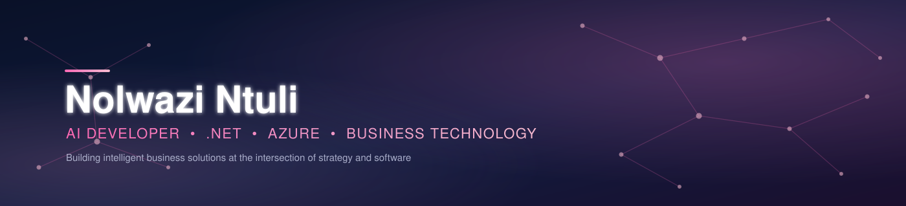

<h1>Hey there, I'm Nolwazi Ntuli 👋</h1>

  

 

## About Me

- I build **AI-powered business applications** using **.NET** and **Azure**.
- I combine **business strategy** with **software development** to solve real business problems.
- Currently completing my **Postgraduate Diploma in Management (PDM)** at **Wits Business School**.
- Passionate about **AI, cloud computing, automation, and intelligent business solutions**.
- Currently building **FunduLwazi**, an AI-powered document intelligence platform.
- My edge is combining strategic business thinking with practical software engineering.

 

## 🚀 Featured Project

### FunduLwazi

An AI-powered business application built with **.NET** and **Azure**, bringing together intelligent automation and real business use cases.

 

## 🛠️ Tech Stack

  

 

## 📊 GitHub Analytics

 

 

## 🏆 Top Languages

 

## 🐍 Contribution Snake

 

## 🎓 Education & Certifications

<table align="center">
<tr>
<td width="100%">

**🏫 Postgraduate Diploma in Management (PDM) — Business Administration**
 Wits Business School · *In progress*

**📜 Getting Started with Artificial Intelligence**
 IBM SkillsBuild · 2026

**📜 Web Development Fundamentals**
 IBM SkillsBuild · 2026

**📜 AWS Cloud Practitioner Essentials**
 Amazon Web Services · 2026

🔄 This section is updated as new certifications are earned.

</td>
</tr>
</table>

 

## 🔗 Let's Connect

 

## 🎯 Career Goals

<table width="85%">
<tr>
<td align="center">

I'm working toward a career as an **AI Developer / Business Technology Specialist**, building intelligent, cloud-native applications with **.NET** and **Azure** that solve real business problems, combining the strategic thinking from my **PDM at Wits Business School** with hands-on software engineering. My goal is to keep growing this intersection through projects like **FunduLwazi** and ongoing **Microsoft Azure certifications**.

</td>
</tr>
</table>

 

✨ Thanks for stopping by, let's build something intelligent together. ✨

